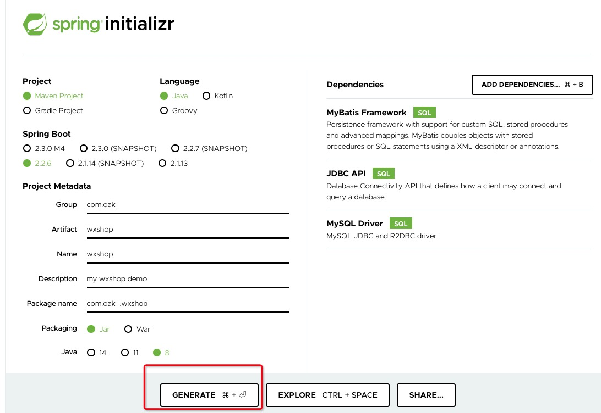

### 项目初始化

google 搜索 spring initializr 得到

- https://start.spring.io/




- 点击图片红色圈中的按钮，会给你一个压缩包！
- 解压当前包，在你的项目目录里

#### 引入 flyway

- https://flywaydb.org/
- 抄文档并不可怕，可怕的是你不知抄的东西是干嘛的！
- 找到 [文档 documentation](https://flywaydb.org/documentation/)
    - USAGE
        - Maven 把这个复制到项目里 pom.xml 里
        ```
        <plugin>
            <groupId>org.flywaydb</groupId>
            <artifactId>flyway-maven-plugin</artifactId>
            <version>6.4.0</version>
        </plugin>
        ```
    - docker启一个 mysql
    ```
    docker run -e MYSQL_ROOT_PASSWORD=root -e MYSQL_DATABASE=wxshop -p 3307:3306 -d mysql
    ```

#### 配置 flyway 数据库连接信息

- 参考  https://github.com/blindpirate/xiedaimala-springboot/blob/master/pom.xml

```
<plugin>
    ...
    <configuration>
        <user>root</user>
        <password>root</password>
        <url>jdbc:mysql://localhost:3307/wxshop?useSSL=false&amp;allowPublicKeyRetrieval=true</url>
    </configuration>
</plugin>
```

#### 自动化迁移 migrations 章节

- https://flywaydb.org/documentation/migrations
- 注意 目录是在  `你的项目/src/main/resources/db/migration` 下新建 你的`V1__Myxxx.sql`
    - 注意 “V1” 代表版本 
    - "V1"后面是 `__` 双下划线，为什么？ 看文档啊！！！

> 命令行创建目录

```
# 项目根目录
mkdir -p src/main/resources/db/migration

# 在这个目录新建
V1__CreateUser.sql
```

> V1__CreateUser.sql 内容如下

- 电话号码一定要用 varchar,指不定以后你的BOSS会出现什么幺蛾子!
- **如果以后对表进行修改，一定不能更改V1**，因为这是记录数据库的一个版本(一个历史)
    - 新增列、或者字段应该 V2、V3 这么累加，如果直接改历史版 你迟早会踩坑的！！

```
create table USER (
  ID bigint primary key auto_increment,
  NAME varchar(100),
  TEL varchar(20) unique,
  AVATAR_URL varchar (1024),
  CREATED_AT timestamp ,
  UPDATED_AT timestamp
)
```

> 项目根目录执行命令

```
mvn flyway:migrate

# 如果数据库有些脏数据，无法新建
mvn flyway:clean flyway:migrate
此时构建成功
```

### 代码仓库

- https://github.com/slTrust/spring-wxshop/


